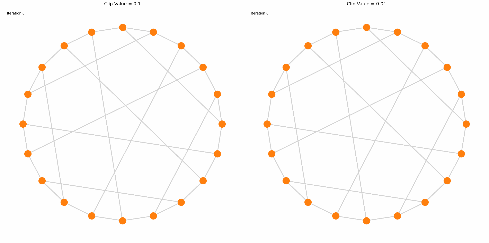
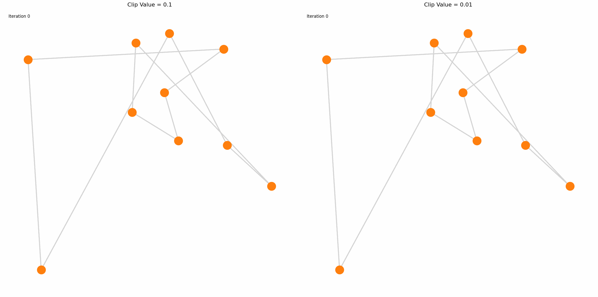
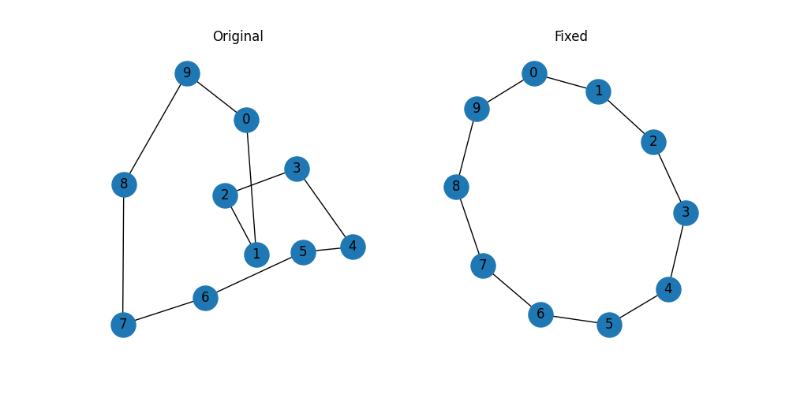
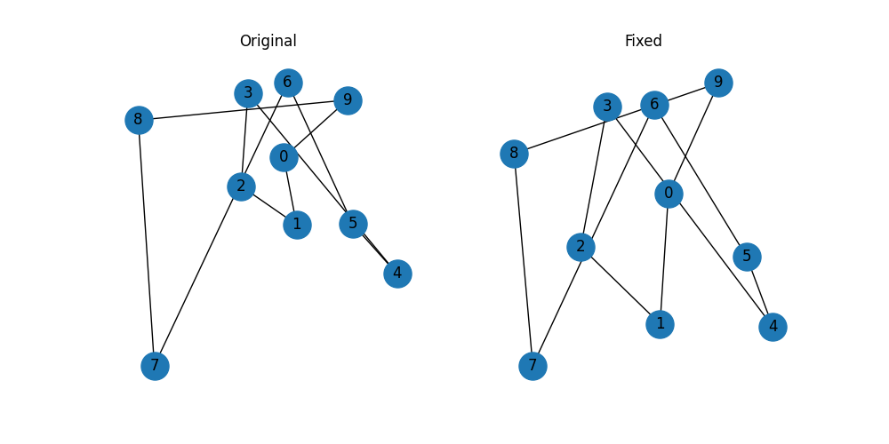
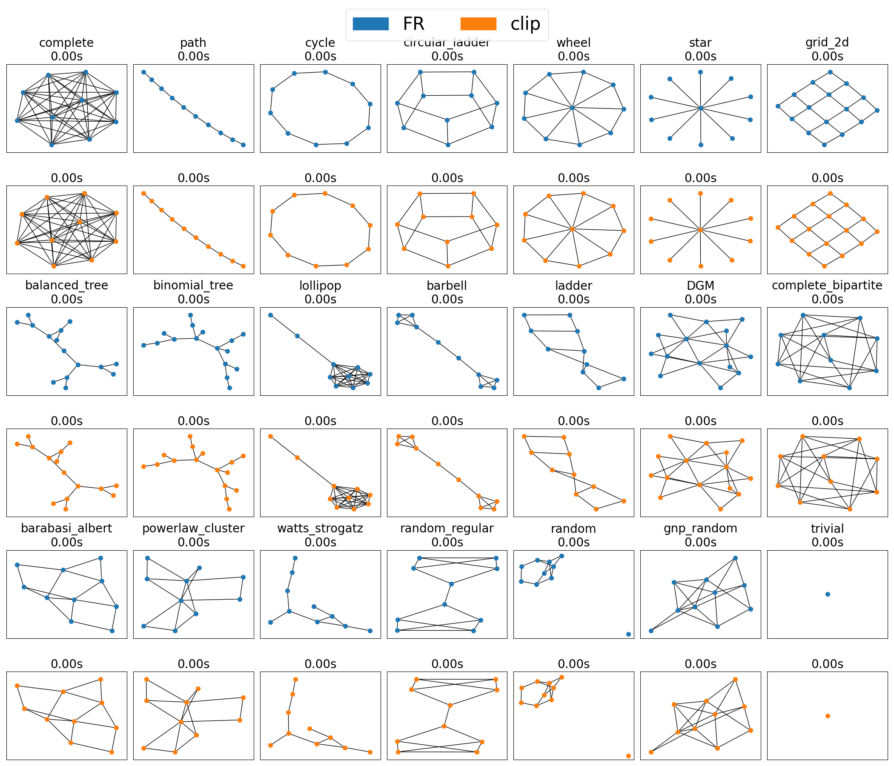
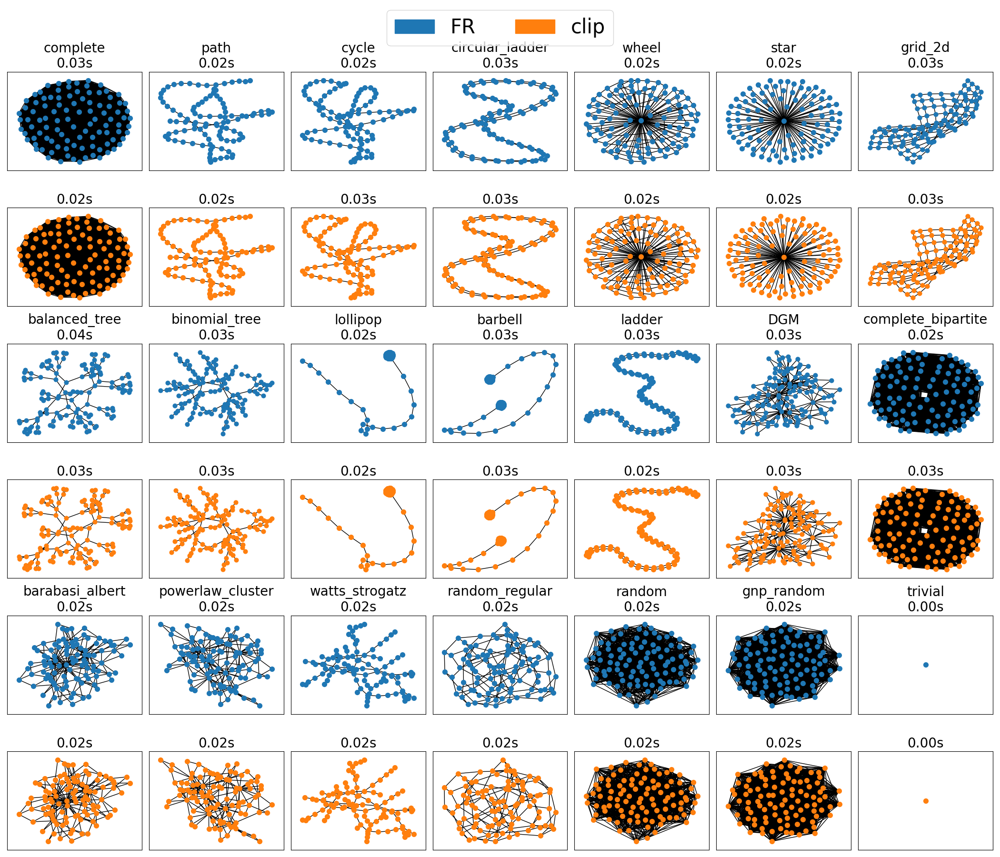
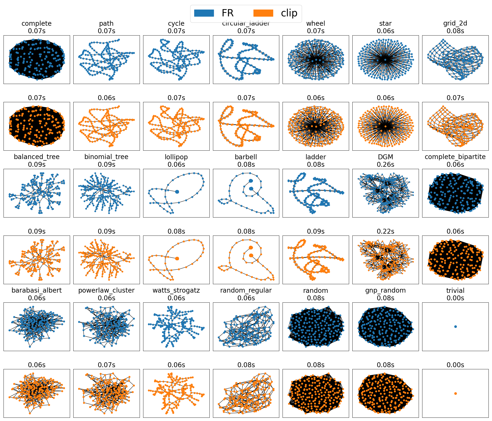

# Reply

Hello, I have looked into this issue and would like to share my thoughts below.

## Summary

* In general, the presence of oscillation is not necessarily a negative phenomenon.
* In specific cases involving certain values of the parameter $k$ and the edge weights $A$, the bug-like code can have a significant negative impact. However, such cases are quite limited.
* I *slightly* recommend changing `np.where(length < 0.01, 0.1, length)` to `np.where(length < 0.01, 0.01, length)`, as it generally causes no harm and improves readability.
* However, keeping the code as-is does not introduce critical issues either, so I would like to leave the decision to the maintainers of NetworkX.

## General Remarks on Oscillation

I agree with rudyarthur’s statement that "undamped spring systems which I think is inevitable."

In fact, I believe such oscillations may even help escape from local optima. Therefore, oscillations themselves are not inherently bad; rather, they are part of the intended behavior.

This kind of oscillation (vibration) behavior has been discussed especially in the context of [Simulated Annealing](https://www.sciencedirect.com/topics/social-sciences/simulated-annealing). Simulated Annealing is a probabilistic optimization algorithm that searches for a good solution by sometimes accepting worse solutions to escape local minima. (Although the present case is somewhat special and not entirely analogous, but similar. The oscillation helps escaping from local optima.)

Regarding temperature schedules, it's also true that many non-linear schedules have been proposed in SA. In practice, exponential temperature schedules tend to work well. While I am not very familiar with the "quadratic schedule," such approaches do exist.

This kind of behavior was also discussed in [the original FR layout paper](https://onlinelibrary.wiley.com/doi/abs/10.1002/spe.4380211102):

> Primarily, we compared a steady decrease in temperature with a combination of quenching and simmering: the first phase starts at a high temperature and cools steadily and rapidly, and the second is at a constant low temperature. The results from the latter schedule were better and required fewer iterations.

Still, I won't discuss this matter in depth here. For now, I just want to emphasize that oscillation is not inherently problematic.

## The Animation

I created an animation based on the code shared by rudyarthur. (Thank you, rudyarthur!)

Note that I modified the following part of the code:

```python
length = np.where(length < XXX, YYY, length)
```

Originally, the `XXX` was a variable. In this animation, I set `XXX` to `0.01` and regard `YYY` as a variable to compare between `0.1` and `0.01`, as mentioned in the initial comment.

Also, I modified the following line:

```python
t = max(max(pos.T[0]) - min(pos.T[0]), max(pos.T[1]) - min(pos.T[1])) * 0.01
```

Original NetworkX's code uses a coefficient of `0.1`, so I corrected it accordingly. This value also significantly influences the results.

The resulting animation is as follows. In this case, there is almost no visible difference.



This suggests that the impact of the bug-like code is negligible in this situations.

## Cases Where Layout Quality Degrades

In more extreme examples—such as when nearly all `length` values fall below 0.01—the effect becomes more apparent.

This typically doesn't happen in normal use cases, where edge weights are not extremely small. Here's one example:

```python
n = 10
A = np.zeros((n, n))
for i in range(n):
    A[i][(i + 1) % n] = 1e-3

G = nx.from_numpy_array(A)

k = 1e-2
```

Using this setup, I compared both versions.



I also tested with random seeds from 0 to 9.
With the modified value `0.01`, 6 out of 10 seeds produced accurate circular layouts, whereas with the original value `0.1`, only 1 out of 10 did.

This suggests that using `0.1` can degrade layout quality in such edge cases.


(With edge weights set to 1e-3)

However, if the edge weights are reduced further, both versions begin to fail. This suggests that the failure is not due to the specific choice between `0.1` and `0.01`, but rather due to the very act of clipping itself.


(With edge weights set to 1e-5)

To avoid this, one could eliminate clipping altogether—but this would lead the numerical instability, which is not desirable.

## General Case Observations

As mentioned above, since `length < 0.01` rarely occurs in typical graphs, the change has little to no effect in most cases.

Here are test results for graphs with uniform edge weights of 1 and default values of $k$. Code is [here](todo).

---


(Graphs with approximately 10 nodes)

---


(Graphs with approximately 50 nodes)

---


(Graphs with approximately 300 nodes)

---

According to output logs, even in graphs with around 300 nodes, the number of nodes with `length < 0.01` never exceeded 28. In most graphs and most iterations, all `length` values exceeded 0.01, meaning clipping did not occur at all.

## Conclusion

To reiterate the main points:

* Oscillations are not inherently problematic—in some contexts, they are beneficial.
* In certain extreme configurations of $k$ and edge weights $A$, layout quality may degrade, but these cases are rare.
* I *slightly* recommend changing `np.where(length < 0.01, 0.1, length)` to `np.where(length < 0.01, 0.01, length)`, since it generally causes no harm and improves clarity.
* However, keeping the current code is also acceptable. I would like to leave the final decision to the NetworkX maintainers.

Thank you.
