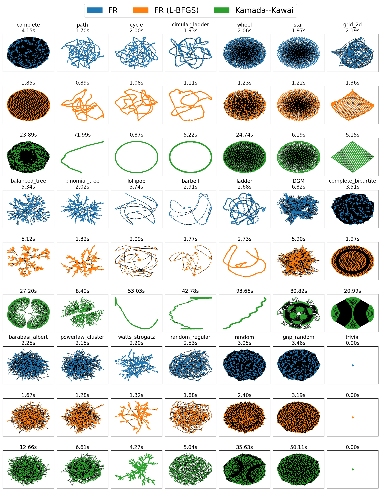
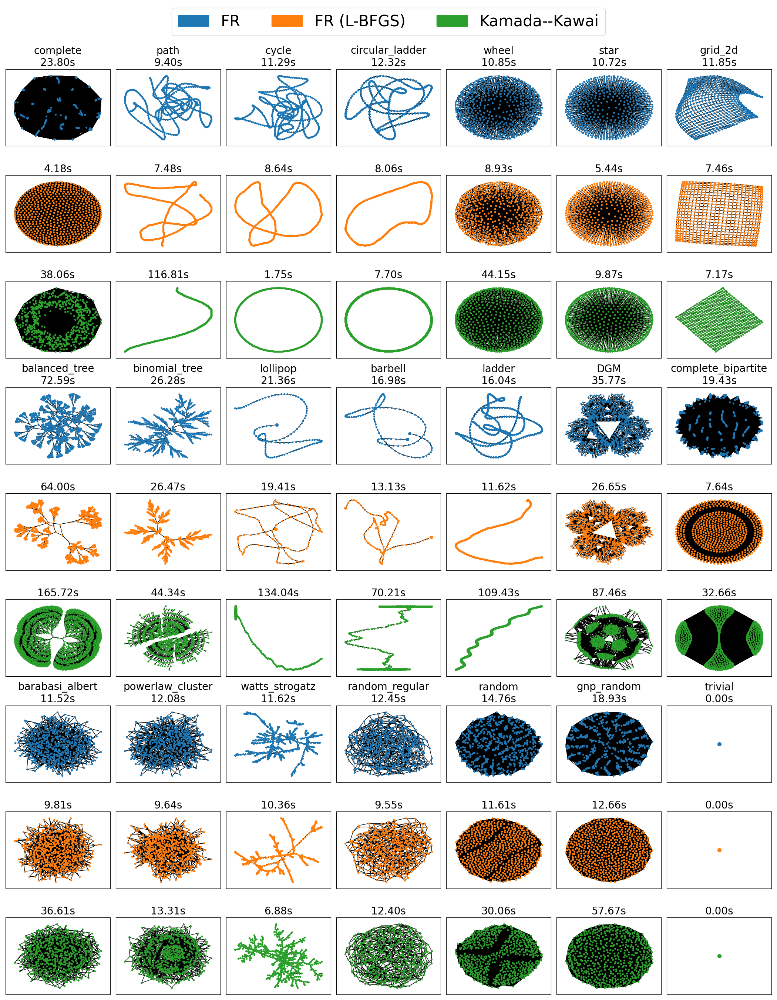
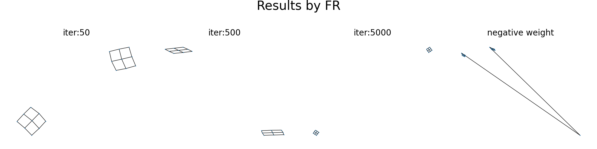
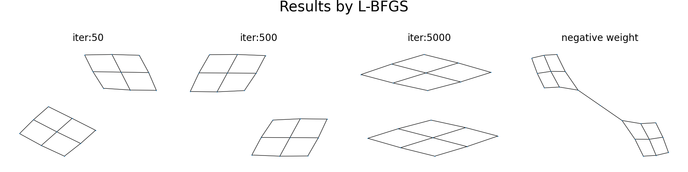
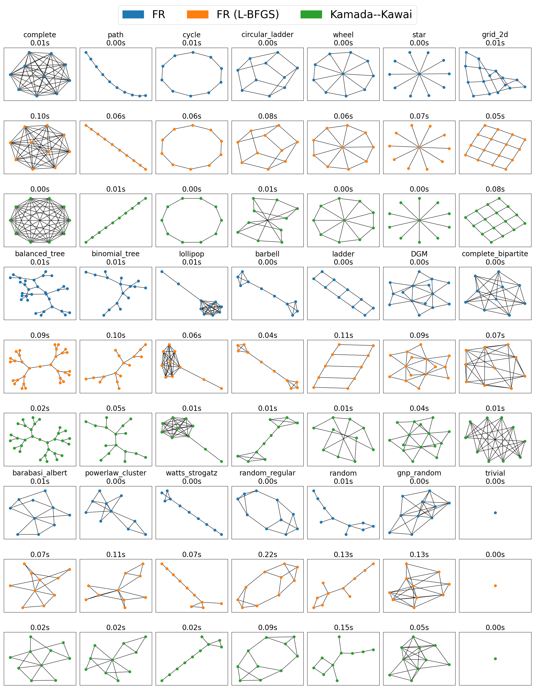
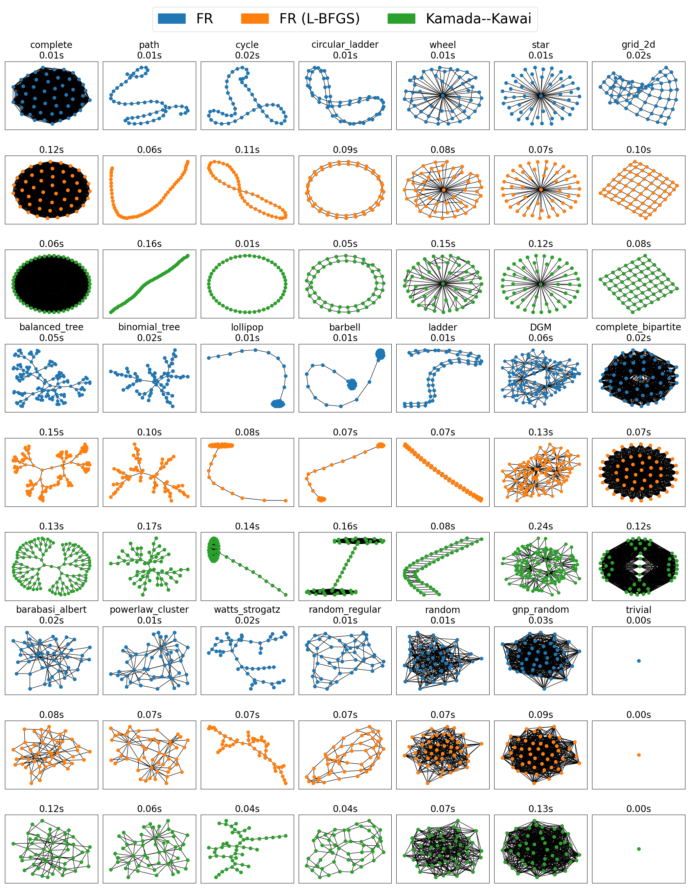
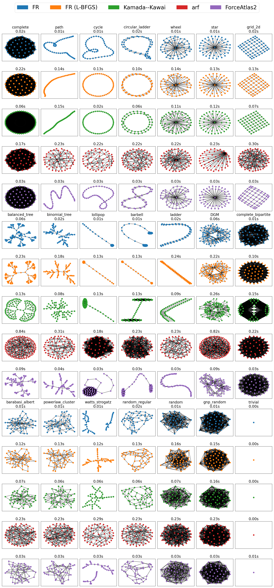
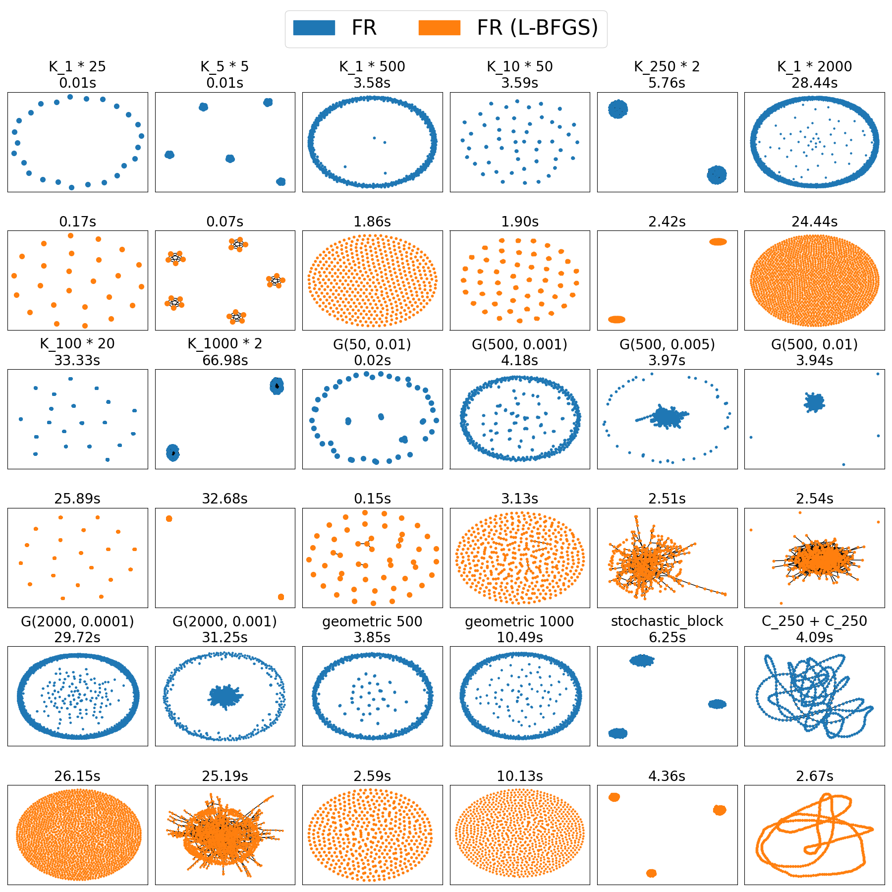
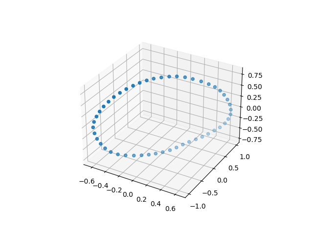
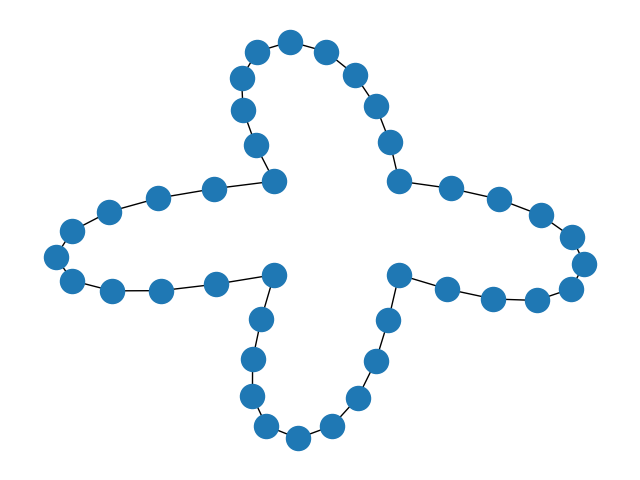

# Pull Request

Hello, NetworkX developers.

I'm Hiroki Hamaguchi from the University of Tokyo, Japan. We want to contribute to NetworkX by improving the `_sparse_fruchterman_reingold` function, a.k.a. `spring_layout`.

We know that this function is one of NetworkX's core features, so we are very careful about the changes and willing to receive any feedback to refine our approach. We hope that our proposal will benefit the NetworkX community.

## Abstract

The **Fruchterman--Reingold (FR) model** is a framework that assumes both attractive and repulsive forces act between vertices. `nx.draw` uses this model and simulates this force system to perform graph drawing.
Here, `_sparse_fruchterman_reingold` is one of the key internal functions called when **the number of vertices exceeds 500**.

To generate faster and better layouts using the FR force model, we aim to **modify this function** by adopting a different approach from the traditional force-directed method. Specifically, we utilize **SciPy's L-BFGS method** to optimize the layout, similar to `nx.kamada_kawai_layout`.

We can broadly classify our proposed method as an **energy-based algorithm**, but it may be more intuitive to interpret the approach as introducing a kind of momentum into the motion simulation and thus achieving a better layout. Please note that our proposal does not introduce a new model; **the conventional interpretation of the FR model works for most cases**.

This method is based on the research by Hosobe, H. [^hosobe] and our research paper [^our]. We can update our paper to explain our proposal more clearly if necessary.

### Key Contribution

Our proposed method can usually achieve better visualization with faster computation. The visualization result is shown in the figure.

$n \approx 500$ and 50 iterations:

$n \approx 600$ and 200 iterations:

### Other Improvements (or Side Effects of Our Proposal?)

The output of our proposed method is theoretically equivalent to the output of the existing method when the graph $G$ is connected and has positive weights. However, the output differs when the graph is not connected or has negative weights due to the current implementation's **ill-defined** extension of the FR algorithm in [^FR].

By **ill-defined**, we mean that the corresponding optimization problem can be unbounded, leading to arbitrary results. This is why our proposed method cannot perfectly reproduce the existing method.

We used the current `nx.spring_layout` in the figure below. The three graphs on the left show the results with the number of iterations set to 50, 500, and 5000, respectively. The rightmost graph contains negative edges.

As the number of iterations increases, the graphs blow away and become unreadable. The same issue arises in the rightmost graph. This is because the optimization problem behind the FR model is ill-defined in these cases, and thus we cannot reproduce the results by the optimization method.

Our proposed method introduces additional forces for each connected component and uses the absolute values of edge weights, preventing such problems. This approach often produces better results, which may not completely match the existing method. This is a side effect of our proposed method, which can be seen as either an advantage or a disadvantage.

## Algorithm

In this section, we describe our proposed algorithm. We also wrote this content in our research paper [^our].

### Problem Formulation

Let $G = (V, E)$ be a graph with vertex set $V = \{1, \dots, n\}$ and edge set $E$.
Each edge $\{ i,j \} \in E$ has weight $a_{i,j}$, possibly negative.
For convenience, we set $a_{i,j}=0$ for $\{i, j\} \notin E$ and define $A \in \mathbb{R}^{n \times n}$ as the weight matrix of $G$.

The FR force model assumes forces between vertices.
For vertices $i$ and $j$ with a distance $d > 0$ between them, an attractive force $F_{i,j}^\mathrm{a}(d)$ and a repulsive force $F^\mathrm{r}(d)$ work as

$$
 F_{i,j}^\mathrm{a}(d) \coloneqq \frac{a_{i,j} d^2}{k}, \quad F^\mathrm{r}(d) \coloneqq -\frac{k^2}{d}
$$

where $k > 0$ is a constant parameter, often set to $1/\sqrt{n}$.

### Energy Function

The energy (or scalar potential) of these forces [^hosobe] is given by

$$
\begin{gather*}
 E_{i,j}^\mathrm{a}(d) \coloneqq \int_{0}^{d} F_{i,j}^\mathrm{a}(r) \mathrm{d}{r} = \frac{a_{i,j} d^3}{3k}, \\
 E^\mathrm{r}(d)       \coloneqq \int_{\infty}^{d} F^\mathrm{r}(r) \mathrm{d}{r} = -k^2\log{d}, \\
 E_{i,j}(d)            \coloneqq E_{i,j}^\mathrm{a}(d) + E^\mathrm{r}(d).
\end{gather*}
$$

For simplicity, we define $E_{i,j}(0)=\infty$.
Let $\|\cdot\|$ denote the Euclidean norm in $\mathbb{R}^2$.
Then, the problem is to minimize the energy with $X \coloneqq (x_1, \dots, x_n)^\top \in \mathbb{R}^{n \times \mathrm{dim}}$:

$$
\begin{align*}
            \min_{X \in \mathbb{R}^{n \times \mathrm{dim}}} \quad f(X) \coloneqq &\sum_{i \neq j} \left( E_{i,j}(\|x_i - x_j\|) \right)\\
 =         {}& \sum_{i \neq j} \left( \frac{a_{i,j} \|x_i - x_j\|^3}{3k} - k^2\log{\|x_i - x_j\|} \right)
\end{align*}
$$

From this formulation, we can see that if there exists $\{i,j\}$ such that $a_{i,j}<0$, then the problem can be unbounded, and some countermeasures are necessary. We have made $A$ non-negative by using $\lvert A \rvert$. Additionally, if $a_{i,j}+a_{j,i}$ are equal, the problem is equivalent, and thus we can symmetrize by setting $(\lvert A \rvert +\lvert A \rvert^\top)/2$. We will proceed with the discussion under this assumption.

### Gradient of the Energy Function

Let us define $f_i$ as the sum of terms related to $x_i$:
$$
\begin{equation*}
 f_i(x_i) \coloneqq \sum_{j \in V \setminus \{i\}} \left( E_{i,j}(\|x_i - x_j\|) + E_{j,i}(\|x_j - x_i\|) \right).
\end{equation*}
$$

Then, the gradient of $f_i$ is given by

$$
\begin{align*}
  \nabla f_i(x_i) ={}& \sum_{j \in V \setminus \{i\}} \frac{(a_{i,j}+a_{j,i})\| x_i - x_j \|}{k} (x_i - x_j)\\
 & - \sum_{j \in V \setminus \{i\}} \frac{2k^2}{\| x_i - x_j \|^2} (x_i - x_j).
\end{align*}
$$

Thus, the $(i,z)$-th element of the gradient $\nabla f \in \mathbb{R}^{n \times \mathrm{dim}}$ is given by
$$
\begin{align*}
 (\nabla f(X))_{i,z} &= \left(\nabla f_i(x_i)\right)_z\\
 &= \sum_{j \in V \setminus \{i\}} \left(\frac{(a_{i,j}+a_{j,i})\| x_i - x_j \|}{k} - \frac{2k^2}{\| x_i - x_j \|^2}\right) (x_{i} - x_{j})_z\\
 &= 2 \sum_{j \in V \setminus \{i\}} \left(\frac{a_{i,j} \| x_i - x_j \|}{k} - \frac{k^2}{\| x_i - x_j \|^2}\right) (x_{i} - x_{j})_z
\end{align*}
$$

### Additional forces

When the graph is not connected and separated into $m$ groups ($V =V_1 \oplus \dots \oplus V_m$), the optimization problem is unbounded since the farther the connected components are, the lower the energy. The well-known solution to this problem is to add a gravity term that attracts the center of each group to the origin. We adopt this solution with the center $x_\mathrm{center}=(0.5, \dots, 0.5)^\top$, since it is the center of the expected bounding box $[0, 1]^{\mathrm{dim}}$.

For the center of the $c$-th component $g_j = \sum_{i \in V_j} x_i / |V_j|$, we define
$$
\begin{gather}
f_g(X) = \sum_{j=1}^m \frac{\lvert V_j \rvert}{2} \| g_j - x_\mathrm{center} \|_2^2,\\
(\nabla f_g(X))_i = g_j - x_\mathrm{center} \quad \text{for } i \in V_j.
\end{gather}
$$

When the graph is connected ($m = 1$), this additional force acts uniformly on all vertices and does not affect the final output.

## Implementation

Please refer to the diff in the pull request for the implementation details.
Here are a few additional notes:

* We used batch processing to improve computational efficiency. The batch size is 500. As far as we tested, even if we increase the batch size more, the efficiency does not improve or sometimes decreases.
* We set `method="auto"` as the default in `nx.spring_layout` because energy-based approaches like ours are relatively rare for the FR force model. We don't want to confuse users.
* Temporary variables such as `distance2` and `Aid` improve computational speed. Although this may make the code look a bit redundant, it was a deliberate trade-off to enhance performance.
* As discussed later, defining the additional force is one of the most challenging problems, not due to mathematical difficulty but rather the philosophical challenges of keeping the implementation concise and what aesthetic principles to base the design on. After various trials, errors, and considerations, we reached the current implementation.

## Evaluation

### NetworkX Graphs

We evaluated our method on various graphs generated by NetworkX with different numbers of vertices: 10, 50, 500, and 600.
We set the number of iterations to 50 or 200. (Note that `nx.kamada_kawai_layout` does not allow specifying the number of iterations.)

From these experiments, we can see that our proposed method (orange, `FR (L-BFGS)`) can, in most cases, achieve better visualization with faster computation compared to the existing method (blue, `FR`).

For small graphs with around 10 vertices, the overhead of the `L-BFGS` method can make it slightly slower, but as the number of vertices increases, this overhead becomes negligible, or our method can even outperform the existing one due to the implementation technique. Since `nx.spring_layout` will use our approach only when the number of vertices exceeds 500 by default, we believe this trade-off is acceptable.

### NetworkX Layouts with Different Methods

We also compared our method with `nx.arf_layout` and `nx.forceatlas2_layout`.
Although these methods do not directly use the FR force model, we think that `FR (L-BFGS)` provides better visualization.

### Graphs from SuiteSparse Matrix Collection

We tested our method on large-scale, real-world graphs from the SuiteSparse Matrix Collection.
The superior performance of our method is evident in these cases as well.

### Special Cases

We confirmed that our method works correctly in special cases.

#### Unconnected Graphs

#### Very Large Graphs

Although we do not provide specific output results here, we confirmed that our method successfully executed on a cycle graph with 100,000 vertices without causing kernel crashes.

We estimate the necessary memory size for the optimization as follows.

1. We used batch processing with a batch size of 500, i,e., the size of `delta` in the `_l_bfgs_fruchterman_reingold` is $500 \times 100000 \times 2$ when the number of vertices is 100,000 and `dim=2`.
2. `delta`'s data type is `np.float64`, which requires 8 bytes.
3. The memory size is $500 \times 100000 \times 2 \times 8 \approx 0.74$ GB.
4. In most modern computers or runtime environments, this memory size is not a problem.

#### 3D Graphs

We confirmed that the method works correctly for graphs with `dim=3`.

#### `fixed` Parameter

Our method also works correctly when the `fixed` and `pos` parameters are specified. The following figure shows the output for a cycle graph with four vertices specified as `fixed`.

## Discussion

We have demonstrated that our proposed method can, in most cases, achieve better visualization with faster computation compared to the existing method.

As far as we anticipate, there are few major inconveniences that users will experience due to this change. If we must point out one, when increasing the number of nodes stepwise from 100 to 1000 and drawing a graph that includes negative edge weights, discontinuities may occur at 500 with `method="auto"`. How to weigh such corner cases against improvements in most situations is a matter of values. We personally think it's not a problem, but we would like to follow the community's intentions.

The most well-known algorithm for the FR force model for large-scale graphs is the multi-level approach, such as [Graphviz's sfdp](https://graphviz.org/docs/layouts/sfdp/). Instead of our approach, we could have implemented this in NetworkX.

However, a complex implementation is not necessarily the best choice for a lightweight library like NetworkX. Furthermore, it is implemented in Python, a language known for its relatively slow execution time.

We believe leveraging SciPy's powerful scientific computing capabilities is a good choice in this situation, and it aligns well with NetworkX's [Mission and Values](https://networkx.org/documentation/stable/developer/values.html#mission-and-values).

We hope our proposal will benefit the NetworkX community.

Thank you for your attention.

[^hosobe]: [Hosobe, H. (2012). Numerical optimization-based graph drawing revisited. In 2012 IEEE Pacific Visualization Symposium (pp. 81-88). IEEE.](https://ieeexplore.ieee.org/iel5/6178307/6183555/06183577.pdf)

[^our]: [Hamaguchi, H., Marumo, N., & Takeda, A. (2024). Initial Placement for Fruchterman -- Reingold Force Model with Coordinate Newton Direction. arXiv preprint arXiv:2412.20317.](https://arxiv.org/abs/2412.20317)

[^FR]: [Fruchterman, T. M., & Reingold, E. M. (1991). Graph drawing by force-directed placement. Software: Practice and experience, 21(11), 1129-1164.](https://onlinelibrary.wiley.com/doi/abs/10.1002/spe.4380211102)
