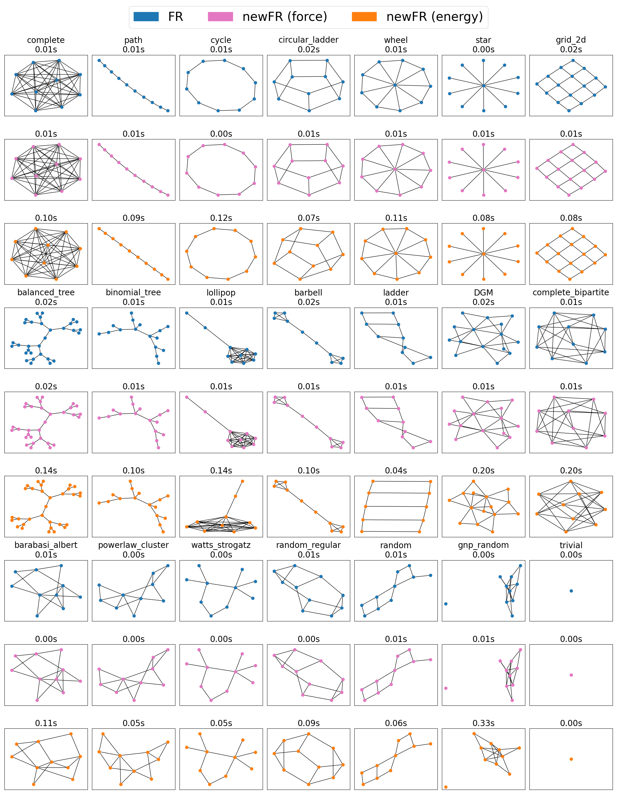
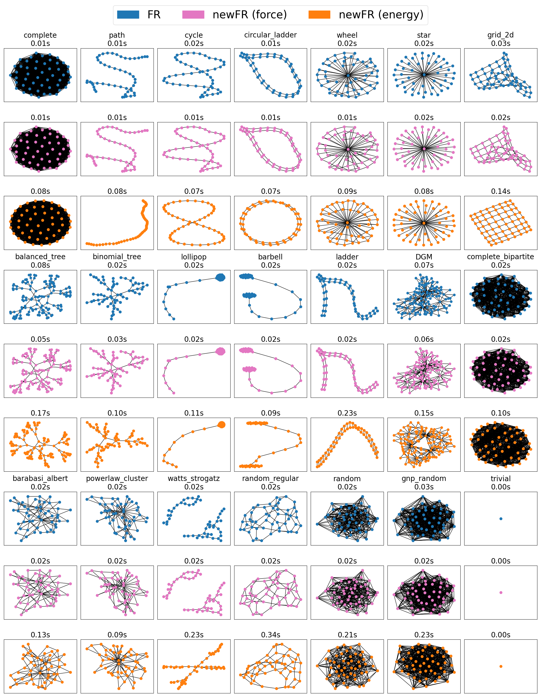
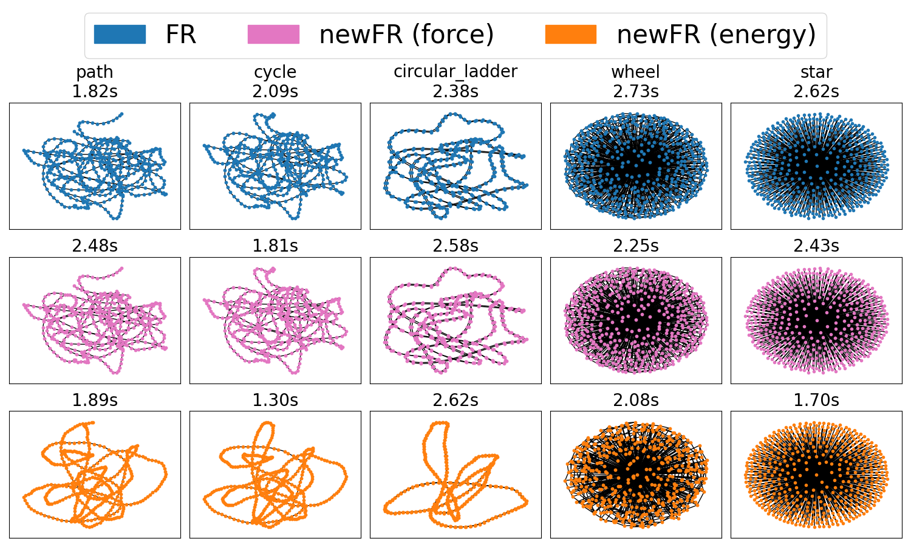
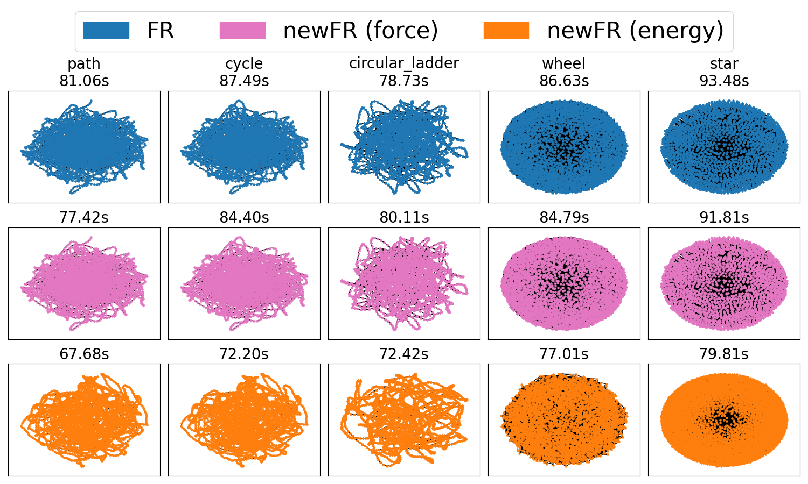

# Reply2.1

Thank you for your valuable feedback!

Below are our responses to your comments.

## Scope of This PR

As you suggested, we agree that the test should be handled in a separate PR. Therefore, this PR will focus solely on adding the proposed method.

If necessary, we will create additional PRs for testing or updating the gallery for documentation.

## Backward Compatibility

Following your suggestion, we modified the code so that the old `_sparse_fruchterman_reingold` method remains accessible, and we renamed our proposed method as `_energy_fruchterman_reingold`.

Now, the old version results can be reproduced by using `method="force"`, which means the blue graphs and pink graphs are the same in the below.

$n \approx 10$ and 50 iterations:

$n \approx 50$ and 50 iterations:

$n \approx 500$ and 50 iterations:

$n \approx 5000$ and 50 iterations:

## Method Naming

Based on your feedback, we considered a lot, and we concluded that our previous statements were **incorrect**. While we initially expressed concerns that the terms might be misleading in a strict technical sense, naming the old version **"force"** and the new version **"energy"** is actually the most intuitive, we think. Thank you for caring about the naming.

From a technical standpoint, we also think they are acceptable, as these terms can be understood as abbreviations:  

- method=**"force"** <- `force-directed Fruchterman-Reingold algorithm`.
- method=**"energy"** <- `energy-based optimization algorithm`.

And, here is the answers to your questions:

**Q1**. Is it possible that someone in the future would want to implement a different optimization routine than L-BFGS?

**A1**. We don't deny the possibility, but we think it is unlikely. We know that `L-BFGS` algorithm is the de facto standard for unconstrained smooth optimization problems (Hiroki Hamaguchi major in optimization and other members are the experts of optimization).
We believe that the `L-BFGS` algorithm is the most suitable choice for this problem.

**Q2 and Q3**. Is it important to indicate whether the method is good for large or small networks in the name? Is it important to indicate whether it is simulating dynamic forces to a steady state vs minimizing energy?

**A2 and A3**. We think both are not so much important. Now we have backward compatibility, and thus the main difference between the two methods is (i) the quality and speed of the output and (ii) `method="energy"` uses absolute values of edge weights and gravitational forces per connected component. Given the shortness of the method name (`force` and `energy`), we think they are the most intuitive and suitable names.

## About Other Your Questions

### Q1

**Q1**. Why didn't you choose to update the small graph option to use the optimizing approach? (I don't want you to do that -- I'm just wondering whether you investigated it at all.)

**A1**. Because it would be the most beneficial for users.

The current implementation often struggles to properly render graphs with 500 or more vertices. For those cases, the advantages of speeding up by the proposed method outweigh the disadvantages caused by slight changes in output interpretation.

However, for graphs with fewer than 500 vertices, the current method generally performs well. To maintain consistency and avoid altering existing behavior, we left the small graph version unchanged.

Still, it might be worth considering changing the threshold from 500 to a different value, such as 100, or 1000?. How do you feel about this?

As shown in the above figures, with the default parameter `iterations=50`, the old version sometimes performs worse than the new version even when $n \approx 50 < 100$.

### Q2

**Q2**. Would it be reasonable to scale the connected component force by a keyword arg parameter? That is, do you think it would be helpful to be able to increase or decrease the force between connected components?

**A2**: Yes, we believe this would be a great addition.

We truly appreciate this thoughtful suggestion.
We also struggled with this aspect and initially aimed for a parameter-free approach, but achieving the best results for all cases was quite challenging. By introducing gravity as an adjustable parameter, users can now more easily achieve their desired results.

---

Once again, thank you for your insightful feedback!
